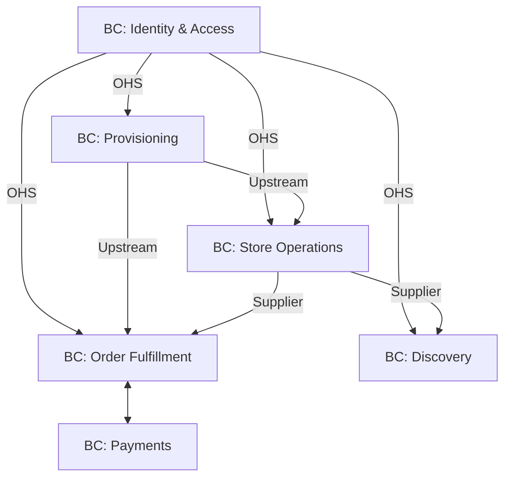

# 09. Context Map

## Objetivo
Visualizar y documentar las relaciones estratégicas entre los Bounded Contexts, definiendo cómo interactúan y qué tipo de dependencia existe entre ellos.

## Mapa de Relaciones Estratégicas

### 1. IAM -> Todos (Open Host Service / Published Language)
El contexto de **Identity & Access** actúa como un proveedor global de identidad.
- **Relación**: Todos los contextos dependen de IAM para validar tokens y roles.
- **Tipo**: OHS (Open Host Service). IAM publica un lenguaje (tokens JWT) que todos entienden.

### 2. Provisioning -> Todos (Upstream/Downstream)
El contexto de **Provisioning** define la existencia de los Tenants.
- **Relación**: Todos los contextos necesitan conocer el `tenant_id` y si está activo.
- **Tipo**: Upstream (Provisioning) / Downstream (Otros). Si Provisioning cambia la estructura del Tenant, los demás deben adaptarse (o usar un ACL).

### 3. Fulfillment -> Operations (Customer/Supplier)
El contexto de **Fulfillment** (Pedidos) consume datos de **Operations** (Catálogo/Stock).
- **Relación**: Fulfillment necesita saber si hay stock y cuál es el precio actual.
- **Tipo**: Customer (Fulfillment) / Supplier (Operations). Operations debe satisfacer las necesidades de información de Fulfillment para completar la venta.

### 4. Discovery -> Operations (Conformist)
El contexto de **Discovery** (Marketplace) muestra lo que hay en **Operations**.
- **Relación**: Discovery simplemente refleja el catálogo publicado.
- **Tipo**: Conformist. Discovery se adapta al modelo de datos que Operations publica para los productos.

### 5. Fulfillment -> Payments (Partnership)
Ambos contextos deben trabajar estrechamente para completar una venta.
- **Relación**: El éxito de uno depende del otro (un pedido no se confirma sin pago, y un pago no tiene sentido sin pedido).
- **Tipo**: Partnership. Los cambios se coordinan entre ambos equipos.

## Diagrama Conceptual (Mermaid)

## Resumen de Patrones de Integración

| Relación | Patrón DDD | Justificación |
| :--- | :--- | :--- |
| IAM a Otros | Open Host Service | Facilita la integración masiva mediante un contrato estándar (JWT). |
| Fulfillment a Payments | Partnership | Sincronización crítica para la transaccionalidad del negocio. |
| Discovery a Operations | Conformist | Discovery es una vista optimizada de Operations, no necesita su propio modelo de producto. |
| Fulfillment a Operations | Anti-Corruption Layer | Fulfillment debe proteger su modelo de pedido de cambios frecuentes en la estructura del catálogo. |

## Referencias Cruzadas
- Ver [08. Bounded Contexts](file:///D:/personales/development/ecommerce-platform/docs/domain/08-bounded-contexts.md) para el detalle de cada contexto.
