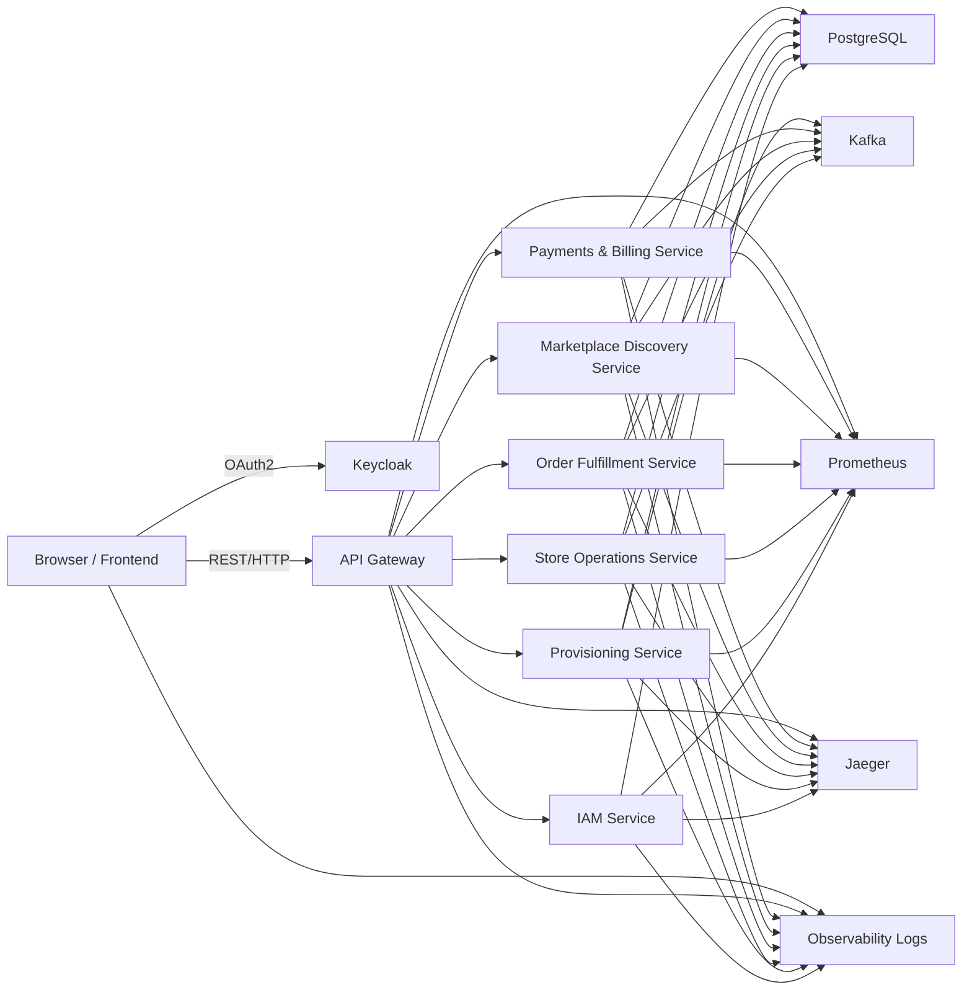

# Deployment Diagrams

Este documento describe la visión de despliegue local y la distribución de componentes en infraestructura de Docker Compose, sin generar un `docker-compose.yml` final.

## Objetivo

- Definir qué servicios se ejecutarán localmente.
- Identificar dependencias de red y visibilidad entre componentes.
- Describir la topología de la plataforma multi-tenant en Docker Compose.

## Despliegue local esperado

### Servicios principales
- PostgreSQL: base de datos relacional compartida por los microservicios.
- Kafka: bus de eventos para comunicación asíncrona.
- Zookeeper: necesario para Kafka en el entorno local actual.
- Keycloak: proveedor de identidad y autorización.
- Backend microservices:
  - Provisioning Service
  - IAM Service
  - Store Operations Service
  - Order Fulfillment Service
  - Marketplace Discovery Service
  - Payments & Billing Service
- Frontend: aplicación React/TypeScript que consume APIs.
- Observabilidad:
  - Log aggregator / visualizador (ej. ELK o Loki)
  - Metrics exporter (Prometheus)
  - Tracing collector (Jaeger)

## Topología propuesta

## Notas de despliegue

- El API Gateway no es un microservicio de negocio aislado, sino un punto de entrada unificado.
- PostgreSQL es la base de datos relacional primaria, compartida por los servicios, pero cada servicio debe tener su propio esquema de datos.
- Kafka es el backbone de eventos de dominio y evita la integración punto a punto.
- El frontend puede ejecutarse como un servicio independiente que consume APIs expuestas por el gateway.
- En local, Keycloak se usa como autoridad de identidad y también para adoptar el modelo multitenant.

## Restricciones

- No se define un archivo `docker-compose.yml` final.
- No se crean Dockerfiles ni configuraciones de red concretas.
- La topología permanece conceptual.
